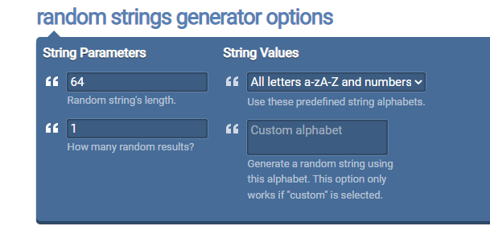

# JWT를 이용한 로그인 처리

## jwt key
https://onlinerandomtools.com/generate-random-string

## jwt로 생성한 토큰 확인
https://jwt.io/

## 토큰발행
http://localhost:8080/login
header에 username, password 입력하여 전송
user/user, admin/admin
로그인 처리가 완료 되면 jwt 발행 후
Response header AUTHORIZATION "Bearer {token}"으로 전송

http://localhost:8080/user
ADMIN, USER 접근 가능

http://localhost:8080/admin
ADMIN 접근 가능
